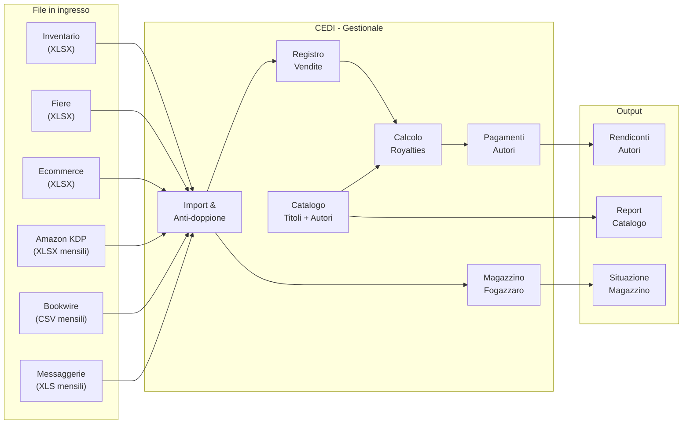
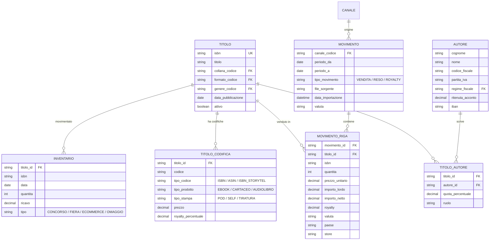
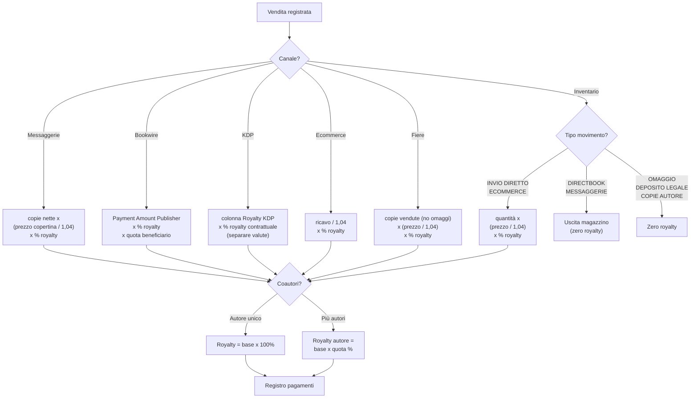
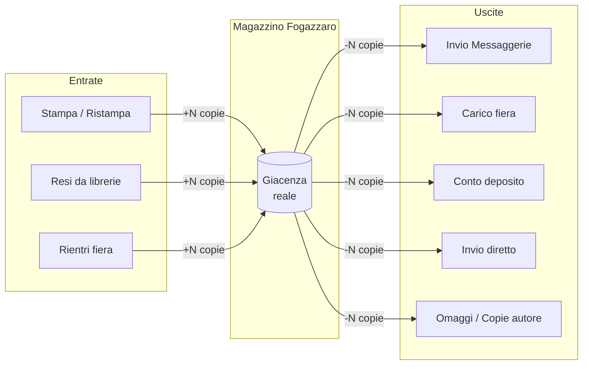

# CEDI - Gestionale Casa Editrice

Gestionale per piccole case editrici indipendenti, costruito con [GenroPy](https://genropy.org).

Nasce da un'esigenza concreta: trasformare decine di report Excel sparsi tra distributori, piattaforme digitali e fogli personali in un sistema unico, leggibile e a prova di errore.

## Il problema

Una piccola casa editrice riceve ogni mese file di vendita da Messaggerie, report da Bookwire, royalties da Amazon KDP, fogli fiere, movimenti ecommerce. Ogni canale ha il suo formato, le sue regole, i suoi tempi. I rischi principali sono quattro:

1. **Pagare due volte le royalties** a un autore per lo stesso periodo
2. **Perdere copie fuori magazzino** senza sapere dove sono finite
3. **Non sapere quante copie ci sono davvero** nel magazzino principale
4. **Non ricordare quali autori sono già stati pagati** e per quale periodo

## Architettura

### Flusso generale dei dati



### Modello dati



### Flusso calcolo royalties



### Flusso magazzino



## Cosa fa il gestionale

### Anagrafiche (package `cedi`)

- **Catalogo titoli**: ISBN, formato, collana, genere, data pubblicazione
- **Codifiche titolo**: ogni edizione (ebook, cartaceo, audiolibro) ha il suo codice (ISBN, ASIN, ISBN Storytel) con prezzo, tipo prodotto, tipo stampa e percentuale royalty specifici
- **Autori**: dati fiscali, IBAN, contratto, ritenuta d'acconto, regime fiscale
- **Relazione titolo-autore**: coautori con quote percentuali per la ripartizione delle royalties
- **Tabelle di codifica**: collane, formati, generi, regimi fiscali

### Vendite e movimenti (package `vendite`)

- **Movimenti**: testata per ogni file importato (canale, periodo, tipo, totali)
- **Righe movimento**: dettaglio per ISBN con quantità, importi lordi/netti, royalty, valuta, paese, store
- **Inventario**: movimenti fisici del magazzino (concorsi, fiere, ecommerce, omaggi, resi)
- **Canali**: Messaggerie, Bookwire, Amazon KDP, BookRepublic, Ecommerce, Fiere, Inventario

### Magazzino Fogazzaro

Il magazzino fisico principale deve mostrare la giacenza reale. Solo i movimenti fisici (ingresso copie, uscite, resi) modificano lo stock. Le vendite digitali e i report royalty non lo toccano.

### Fiere

Gestite separatamente dal conto deposito. Il ciclo completo è: carico fiera → venduto fiera → omaggi → rientri. Le copie non devono essere scaricate due volte dal magazzino.

### Conto deposito

Traccia i libri inviati ai clienti: inviati, venduti, resi, ancora fuori. La royalty matura solo sul venduto dichiarato, non sull'invio.

### Calcolo royalties

Il sistema deve calcolare il dovuto agli autori con regole diverse per canale:

**Messaggerie** (vendite fisiche tramite distributore):
```
Royalty = copie nette × (prezzo copertina / 1,04) × % royalty contrattuale
```
Le vendite si sommano, le rese si sottraggono. La base è il prezzo di copertina al netto dell'IVA al 4%, non il netto Messaggerie.

**Bookwire / BookRepublic** (vendite digitali tramite aggregatore):
```
Royalty = Payment Amount Publisher × % royalty × quota beneficiario
```
La base è la quota netta percepita dall'editore. I resi (Sale Type = retour) vanno inclusi perché sono già negativi. I freegoods generano zero royalty.

**Amazon KDP** (vendite dirette Amazon):
```
Royalty = colonna Royalty del report KDP × % royalty contrattuale
```
Non bisogna riapplicare il 70%/60% di Amazon (è già nella colonna Royalty). Non usare il prezzo medio di listino come base. Separare le valute (EUR, GBP, USD) e convertire con il cambio effettivo del Payment Report KDP. Includere le righe KENP/Kindle Unlimited.

**Ecommerce** (vendite dirette dal sito):
```
Royalty = ricavo / 1,04 × % royalty
```
La base è il ricavo al netto dell'IVA. Non sottrarre commissioni o costi di spedizione salvo diverso accordo contrattuale.

**Fiere**:
```
Royalty = copie vendute (omaggio=0) × (prezzo copertina / 1,04) × % royalty
```
Gli omaggi non generano royalty, vanno solo conteggiati a parte.

**Inventario** (invii diretti):
```
Royalty solo su movimenti INVIO DIRETTO ed ECOMMERCE
```
Esclusi: Directbook, Messaggerie (uscite magazzino terzi), omaggi, deposito legale, copie autore (zero royalty).

**Audiolibri** (Storytel/Storyside):
```
Base = MIN(quota editore, saldo EUR) per prudenza
Royalty = base × % royalty contrattuale
```
Solo i saldi positivi generano pagamento. I saldi negativi restano a nuovo.

**Coautori**: se un titolo ha più beneficiari, la royalty si ripartisce per quota:
```
Royalty autore = base royalty titolo × % royalty × quota beneficiario
```

### Pagamenti autori

Registro separato per sapere chi è stato pagato, quando, per quale periodo e quanto resta da saldare. Gestione ritenuta d'acconto.

### Import e anti-doppione

Ogni file importato lascia traccia con: nome file, data importazione, canale, periodo, numero righe. Il sistema controlla duplicati (stesso file già importato), conflitti (stesso periodo/canale già presente), righe anomale.

## Struttura del progetto

```
cedi/
├── packages/
│   ├── cedi/                    # Catalogo e anagrafiche
│   │   ├── model/               # Tabelle: titolo, autore, collana, codifica...
│   │   ├── resources/tables/    # Interfacce (view, form, batch)
│   │   └── webpages/
│   └── vendite/                 # Vendite e movimenti
│       ├── model/               # Tabelle: movimento, riga, inventario, canale
│       ├── resources/tables/
│       └── webpages/
├── scripts/
│   ├── import_anagrafica.py     # Importa catalogo titoli da Excel
│   └── import_vendite.py        # Importa vendite da tutti i canali
└── instances/
    └── cedipg/                  # Istanza PostgreSQL
```

## Requisiti

- Python 3.8+
- PostgreSQL
- [GenroPy](https://github.com/genropy/genropy) installato nel virtualenv
- `openpyxl`, `xlrd` per gli script di importazione

## Installazione

```bash
# Clona il progetto nella cartella genropy_projects
cd ~/sviluppo/genropy_projects
git clone https://github.com/fporcari/cedi.git

# Crea il database
gnr db setup cedipg

# Avvia il server
gnr web serve cedipg
```

## Importazione dati

Gli script di importazione leggono i file dalla cartella `DELRAI/` (non inclusa nel repo).

```bash
# Importa anagrafica titoli
python scripts/import_anagrafica.py --instance cedipg --clear

# Importa tutte le vendite
python scripts/import_vendite.py --instance cedipg --clear

# Importa solo un canale/anno
python scripts/import_vendite.py --instance cedipg --canale messaggerie --anno 2025
```

Canali supportati: `messaggerie`, `bookwire`, `kdp`, `inventario`, `fiere`, `ecommerce`, `tutti`.

## Stato del progetto

Il progetto è in fase iniziale. Sono implementati:

- [x] Anagrafica titoli con codifiche multi-formato (ISBN/ASIN/ISBN Storytel)
- [x] Anagrafica autori con dati fiscali e quote coautore
- [x] Import catalogo da Excel
- [x] Import vendite Messaggerie (vendite e resi, formato XLS)
- [x] Import vendite Bookwire (formato CSV)
- [x] Import royalties Amazon KDP (formato XLSX)
- [x] Import inventario, fiere, ecommerce (formato XLSX)
- [x] Collegamento automatico ISBN/ASIN ai titoli del catalogo

Da implementare:

- [ ] Magazzino Fogazzaro con giacenza reale
- [ ] Gestione fiere (carico/scarico/rientri)
- [ ] Conto deposito
- [ ] Calcolo royalties per canale con le regole sopra descritte
- [ ] Gestione coautori e quote nella ripartizione royalties
- [ ] Registro pagamenti autori con saldo residuo
- [ ] Import log con controllo anti-doppione
- [ ] Import BookRepublic (storico)
- [ ] Import audiolibri (Storytel/Storyside)
- [ ] Rendiconti autori stampabili
- [ ] Report catalogo, conto deposito, fiere

## Licenza

Questo progetto è distribuito con licenza open source. Contributi benvenuti.
